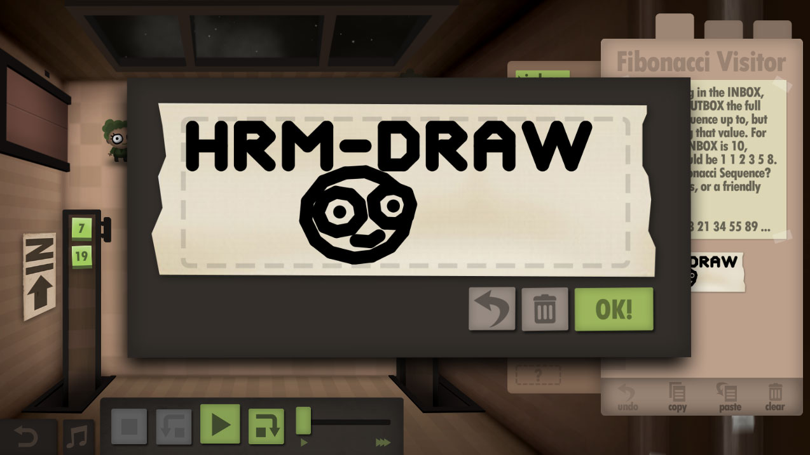

# hrm-draw
## A library for manipulating Human Resource Machine labels and comments



> Human Resource Machine is a puzzle game. In each level, your boss gives you a job. Automate it by programming your little office worker! If you succeed, you'll be promoted up to the next level for another year of work in the vast office building. Congratulations!

### NPM

`npm install hrm-draw`

### Usage

Requires node 4.x - uses ES6

```javascript
const draw = require( 'hrm-draw' )

const Canvas = draw.Canvas

const canvas = Canvas()

canvas.text( 'Hello\nWorld!' )

console.log( canvas.toImage() )

/*
eJztjjGKwzAQRQdcaostXGaJmq2MwVWqBMa9cbFVmoAglZtU7lREdXCRPhjmBL6C5ig+yn6tfIolHwZm
9P/MU0dEWrDRQnu0JCUbKXOvBdVSUp16W7FZ96m0t1X21z3Vtsq+O7BxB+2l3bwO2Q7Zc57d1e7cdT3R
gMxNex7XE492Jzc2NGAXfmaqbz444g/+84tj+Fb/997IpI1bwIl0hN+6RVqZ6KgeXJ/8jRvB9eB6vchk
z2EOP2HWC/aSBtwbOPKY53BH7oEbT5nc0y36APOeKnPlpV5eYc79duOtt/6RfgF3WGZf;  
*/

```

You can also draw lines, save to SVG etc., see the examples folder for more

### License

MIT